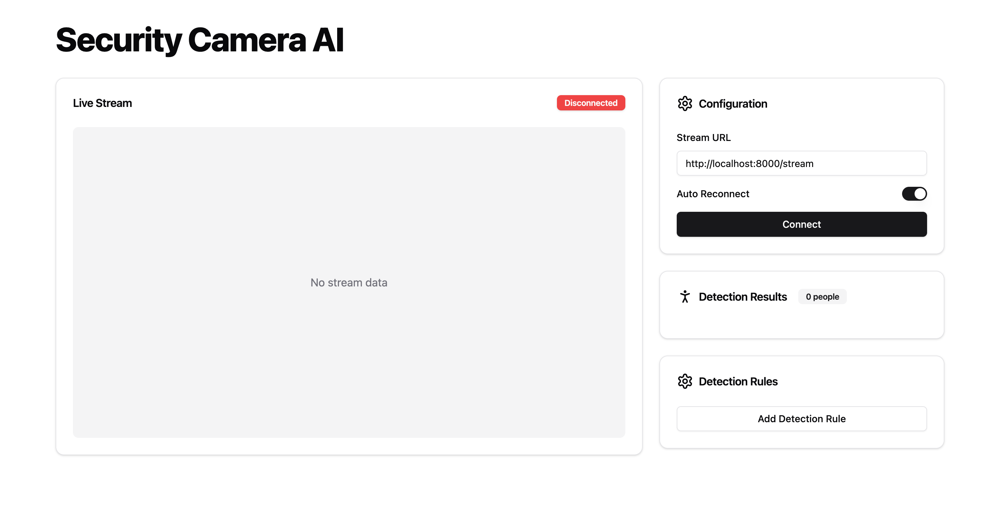

# Security Camera AI

An AI-powered security camera system that uses YOLOv8 for real-time object detection with customizable detection rules.



## Features

- Real-time object detection using YOLOv8
- Customizable detection rules
- Person counting
- Detection notifications
- REST API for rule management

## Setup

### Backend Setup

1. Install the required Python packages:
```shell
uvicorn main:app --reload
```

```shell
npm run dev
```
